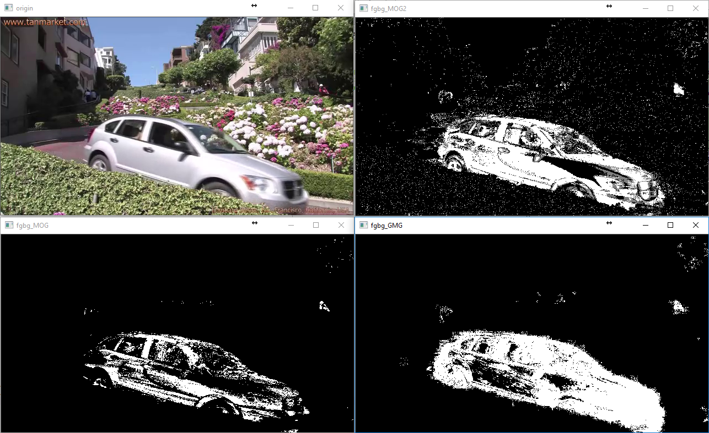

# openCV_backgroundSubtractor  
Three different types of background subtraction in openCV  
  
### 1. MOG -- Gaussian Mixture-based Background/Foreground Segmentation Algorithm.  
“An improved adaptive background mixture model for real-time tracking with shadow detection” in 2001.   
by P. KadewTraKuPong and R. Bowden  

### 2. MOG2 -- Gaussian Mixture-based Background/Foreground Segmentation Algorithm.  
“Improved adaptive Gausian mixture model for background subtraction” in 2004 and  
“Efficient Adaptive Density Estimation per Image Pixel for the Task of Background Subtraction” in 2006.  
by Z.Zivkovic  

### 3. GMG -- Algorithm combines statistical background image estimation and per-pixel Bayesian segmentation.  
“Visual Tracking of Human Visitors under Variable-Lighting Conditions for a Responsive Audio Art Installation” in 2012.  
by Andrew B. Godbehere, Akihiro Matsukawa, Ken Goldberg  
  

